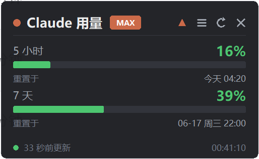
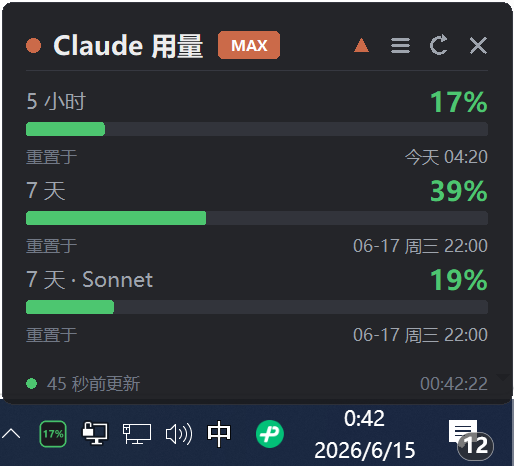
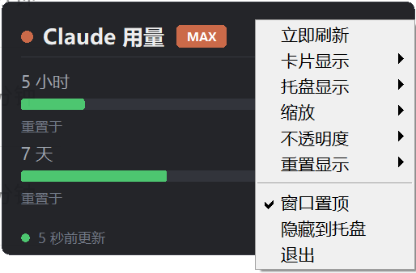

# Claude Usage Assistant

A tiny, always-on-top desktop card for **Windows** that shows your **Claude Code** usage limits in real time — the 5-hour and 7-day rolling windows (plus per-model windows such as 7-day Sonnet / Opus), each with its **reset time in your local timezone**. Includes a system-tray indicator.

It does **not** bypass any limit — it just makes the official numbers visible so you can pace yourself.

English | [简体中文](README.zh-CN.md)

<p align="center">
  <br>
  <sub>The live card: 5-hour / 7-day / per-model windows, color-coded, each with its real reset time in your local timezone.</sub>
</p>

<p align="center">
  
  &nbsp;&nbsp;
  
</p>
<p align="center">
  <sub><b>Left:</b> the tray icon shows your chosen window's % right in the taskbar (the green <b>17%</b> at the bottom-left), and the card can list every window your account exposes — here 5-hour, 7-day, and 7-day · Sonnet. &nbsp;·&nbsp; <b>Right:</b> the menu lets you toggle <b>each window on the card individually</b> and pick <b>which one the tray reflects</b>.</sub>
</p>

## Features

- **Live 5-hour & 7-day usage** (and any other windows your account exposes), color-coded green / amber / red.
- **Real reset time, your timezone** — shown as a local clock like `今天 04:19` / `06-17 21:59`, derived from your system timezone (UTC+8, UTC+7, …) automatically. A live system clock sits in the footer.
- **System-tray icon** showing a chosen window's percentage with a `%` sign (default: 5-hour). Left-click toggles the card; hover for a full breakdown.
- **Frameless, draggable, always-on-top card.** Resize by mouse-wheel, by dragging the window edges/corners, or via the menu.
- **Menu** (right-click or the `☰` button): **show or hide each window on the card individually** (5-hour, 7-day, 7-day · Sonnet, …), pick **which one the tray reflects**, plus zoom, opacity, and reset-display mode (clock vs. countdown).
- Remembers position, size, opacity, and preferences. **Single-instance guard.** Optional **autostart**.
- Pure standard-library **tkinter** UI — no heavy UI framework. ~600 lines, single file, fully auditable.

## Security & privacy

- Reads your existing Claude Code OAuth token **read-only** from `~/.claude/.credentials.json`.
- The token is placed **only** in the `Authorization` header and sent **only** to **`api.anthropic.com`** — the same call Claude Code itself makes.
- **No telemetry, no third-party servers.** Nothing is written out, cached, or uploaded anywhere, except a local `card_state.json` holding window position and UI preferences (it contains **no** credentials).
- It only **displays** official usage; it does **not** bypass, modify, or work around any limit.
- All of it lives in [`quota_card.py`](quota_card.py) — read every line.

## Disclaimer

This tool reads usage from `https://api.anthropic.com/api/oauth/usage`, an **undocumented internal endpoint** used by Claude Code. It is not a public/official API and **may change or stop working at any time**. The endpoint URL and field names are kept as constants near the top of `quota_card.py` so a fix is a one-line change. This project is **not affiliated with or endorsed by Anthropic**.

## Requirements

- Windows 10 / 11
- Python 3.10+
- [`requests`](https://pypi.org/project/requests/) (required)
- [`pystray`](https://pypi.org/project/pystray/) + [`Pillow`](https://pypi.org/project/pillow/) (optional — for the system tray; the app degrades to card-only if missing)
- You must have signed in to Claude Code at least once, so `~/.claude/.credentials.json` exists.

## Install & run

```sh
pip install requests pystray pillow
python quota_card.py
```

Or double-click **`启动卡片.bat`** (launches with no console window).

Verify the data pull without opening the UI:

```sh
python quota_card.py --check
```

## Deploy from scratch (Windows)

1. Install **Python 3.10+** from [python.org](https://www.python.org/downloads/) and tick **"Add python.exe to PATH"**.
2. Clone the repo and enter it:
   ```sh
   git clone https://github.com/huanchong-99/claude-usage-assistant
   cd claude-usage-assistant
   ```
3. Install dependencies:
   ```sh
   pip install requests pystray pillow
   ```
4. Make sure you have signed in to **Claude Code** at least once, so `~/.claude/.credentials.json` exists.
5. Run it (or double-click **`启动卡片.bat`** for a console-less launch):
   ```sh
   python quota_card.py
   ```
6. *(Optional)* Autostart on boot: press `Win+R`, type `shell:startup`, and drop a shortcut to `启动卡片.bat` into that folder.

## One-paste AI setup

Don't want to do it by hand? Paste the block below to an AI coding assistant (e.g. **Claude Code**) and it will set everything up for you:

```text
When you read this, you are an AI coding assistant. Please deploy "Claude Usage Assistant" on this Windows machine:
1. git clone https://github.com/huanchong-99/claude-usage-assistant and cd into the folder.
2. Detect Python (3.10+) and install dependencies: pip install requests pystray pillow
3. Confirm I have signed in to Claude Code (i.e. ~/.claude/.credentials.json exists); if not, tell me to run `claude` and log in first.
4. Run `python quota_card.py` and verify the card shows my usage; if it errors, diagnose and fix it.
5. Ask whether I want it to start automatically on boot; if yes, put a shortcut to 启动卡片.bat into the shell:startup folder.
Report back in my language when done.
```

## Controls

- **Drag** the card to move it (position is remembered).
- **Mouse-wheel** to zoom · **drag window edges/corners** to resize · **Ctrl + wheel** to fine-tune opacity.
- **Top bar:** `▲` keep-on-top · `☰` menu · `↻` refresh · `✕` quit.
- **Menu** (right-click or `☰`): Refresh · **Card items** (tick each window — 5-hour / 7-day / 7-day · Sonnet … — to show or hide it on the card) · **Tray item** (which window's % the tray shows) · Zoom · Opacity · Reset display · Keep on top · Hide to tray · Quit.
- **Tray icon:** shows the selected window's `%`; left-click toggles the card; right-click for the menu.

Bar colors: green `< 50%`, amber `50–80%`, red `≥ 80%`.

## Configuration

Constants near the top of `quota_card.py`:

- `REFRESH_INTERVAL` — auto-refresh seconds (default `60`).
- `API_URL_USAGE` and the field names — edit here if the endpoint ever changes.

Preferences (position, zoom, opacity, shown items, tray item, reset mode) are saved to `card_state.json`.

## Autostart (optional)

Press `Win + R`, type `shell:startup`, and drop a shortcut to `启动卡片.bat` (or to `pythonw.exe "…\quota_card.py"`) into that folder.

## Friend Links

- [LINUX DO](https://linux.do/) — a community for developers and tech enthusiasts.

## Credits

- Data approach referenced from [jens-duttke/usage-monitor-for-claude](https://github.com/jens-duttke/usage-monitor-for-claude).
- The official `rate_limits` field is documented in the [Claude Code status line docs](https://code.claude.com/docs/en/statusline).

## License

[MIT](LICENSE)
